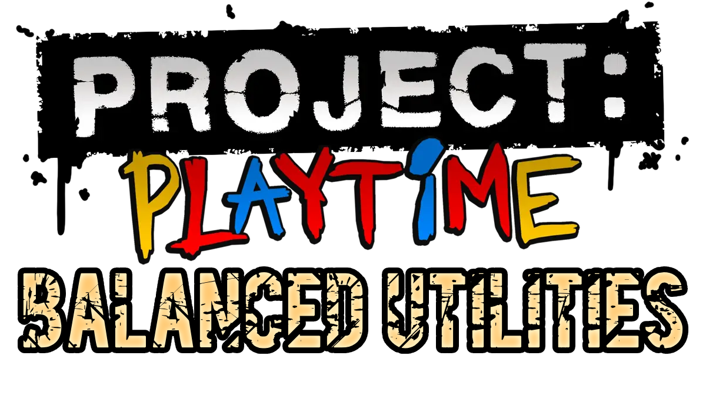

  

A mod that I made for Project: Playtime which aims to balance the game more to have more close calls and survivors being close to losing, or even actually losing, and other useful things that aren't directly related to balancing. Post suggestions/feedback/bug reports in Issues!

## Explanation:
If there's a ◇ next to a feature, it means it can only work for everyone if they have the mod installed, the host having it is not enough.

If there's a ◈ next to a feature, it means it will partially work for everyone if the host has the mod, in most cases this means features for other players may look different on their screen but still work as the mod intends for them.

If there's a ◆ next to a feature, it means the host having the mod is enough for it to fully/mostly work for other players.

Things after a | are the reasons/descriptions for the change.

## Current Features:
◇ **Higher Chat Limit (56 Characters >> 512 Characters) | This is to remove any moments where you have to use multiple messages to type something, the default character limit sucks.**

◈ **Removed Dash Handles                                | This is to balance the game out a bit, since dash handles are extremely overpowered and the monster will not be able to catch players in most cases.**

◆ **Slightly Harder Puzzles                             | Puzzles have been made slightly harder due to players being able to speedrun them without the monster getting a chance at killing anyone, especially if the survivors are tryhards.**

 ⌊ Reflex Puzzle       (16 Ticks >> 22 Ticks)
 
 ⌊ Memory Puzzle       (8 Buttons >> 11 Buttons)
 
 ⌊ Maze Puzzle         (100 Ball Speed >> 60 Ball Speed)
 
 ⌊ Claw Puzzle         (1.1 Speed Increase >> 1.6 Speed Increase)
 
 ⌊ Collage Puzzle      (0.5s Rotate Duration >> 1s Rotate Duration)
 
◆ **Shorter Monster Release Timer (30s >> 20s)          | This is to give survivors less time to get a head start on puzzles. NOTE: This does not seem to work currently, will probably try to fix later.**

◆ **Longer Match Timer                                  | This is to give the monster more time to find players if they're trying to stall the entire game by hiding, especially when the monster is huggy.**

 ⌊ Toy Collecting      (15 Minutes >> 30 Minutes)
 
 ⌊ Pulling Down Pipe   (3 Minutes >> 10 Minutes)
 
 ⌊ Escape Sequence     (5 Minutes >> 8 Minutes)
  
◆ **Doors Stay Closed For Longer (3s >> 5s)             | This is to help players escape a bit easier since dash handles were previously the easiest way to escape the monster.**

◈ **Lockers Take More Hits To Open (4 Hits >> 5 Hits)   | This is to make monsters not want to open lockers which hopefully will make players at least try to use them, since they're very underused.**

◇ **Re-Added Quick Play Button                          | Adds the quick play button from phase 1 back into phase 2, because why not? It works fine, and may be useful sometimes.**

◇ **No Early Access Overlay                             | Removes that annoying early access overlay that sits at the bottom right of your screen, less UI clutter!**

◈ **Sabotage Rebalance                                  | Most sabotages have been changed to balance them out compared to other sabotages, since No Escape has always been the only one that's used, and was very overpowered.**

 ⌊ _Sabotage Changes List Not Done Yet!_

◇ **Unlock All Cosmetics                                | This mod will also give you all cosmetics so your character can look cool! This does not include emotes, you will have to use a cosmetic mod on phase 3, equip emotes there, then use them in phase 2.**

◆ **A Lot Of Tickets                                    | You will get around a million tickets for a lot of actions that normally give a very little amount!**
 
 ⌊ Puzzles Completed   (20 Tickets >> 2M Tickets)
 
 ⌊ Players Revived     (10 Tickets >> 1M Tickets)
 
 ⌊ Players Extracted   (30 Tickets >> 3M Tickets)
 
 ⌊ Toy Parts Carried   (0 Tickets >> 50K Tickets)
 
 ⌊ Toy Parts Deposited (5 Tickets >> 500K Tickets)
 
 ⌊ Time Survived       (0 Tickets >> 10K Tickets)
 
 ⌊ Escaped On Train    (0 Tickets >> 5M Tickets)
 
 ⌊ Skillful Extraction (0 Tickets >> 30M Tickets)
 
 ⌊ Adept Extraction    (0 Tickets >> 20M Tickets)
 
 ⌊ Near Escape         (0 Tickets >> 10M Tickets)
 
 ⌊ Players Downed      (20 Tickets >> 2.5M Tickets)
 
 ⌊ Players Deposited   (30 Tickets >> 3M Tickets)
 
 ⌊ KillDCs             (0 Tickets >> 50K Tickets)
 
 ⌊ Toy Parts Remaining (0 Tickets >> 500K Tickets)
  
◈ **Monster Rebalance                                   | Monsters have had some of their stats changed to balance them out and to also encourage use of monsters other than boxy.**

 ⌊ Boxy                (200 Hit Reach >> 170 Hit Reach, 12s Grab Cooldown >> 17s Grab Cooldown, 0.4s Barrage Cooldown >> 0.8s Barrage Cooldown)

 ⌊ Huggy               (10 Additive FOV >> 3 Additive FOV, 15s Baby Huggy Cooldown >> 12s Baby Huggy Cooldown)

 ⌊ Mommy               (60s Spotter Cooldown >> 40s Spotter Cooldown, 40 Damage >> 45 Damage, 4K Max Grapple Distance >> 6K Max Grapple Distance)

## How To Get The Mod:
Tutorial is work In Progress! For now, go to yarnaby the legend's yt channel and watch his video called "Download my project playtime mod" or something similar, when he gets to the part where you add his mod, you can instead follow it but with my mod files instead! Despite what he says, this will work on phase 2, and my mod does not support phase 3 yet, it may in the future.
