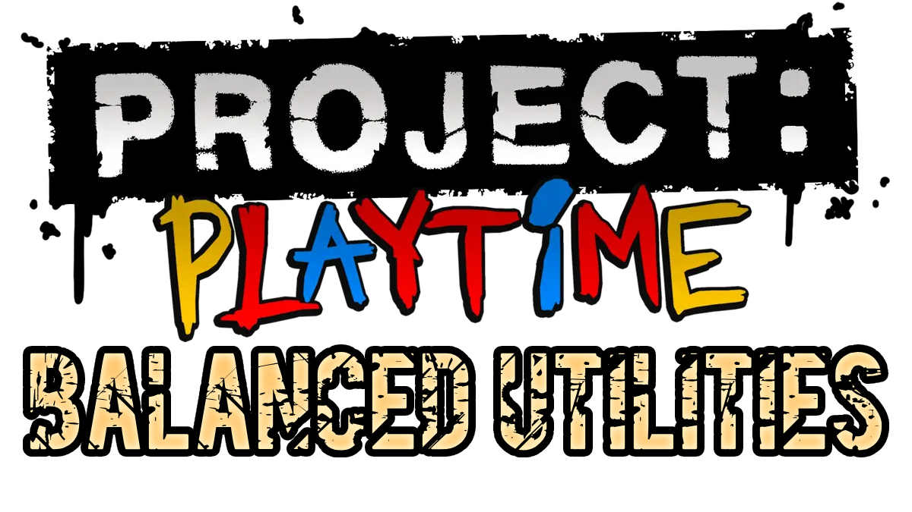

  

A mod that I made for Project: Playtime (Phase 2 Version 2.0.3), which aims to balance the game more to have more close calls and be more tense and challenging as a survivor, and other useful things that aren't directly related to balancing. Post suggestions/feedback/bug reports in Issues!

## Explanation:
If there's a ◇ next to a feature, it means it can only work for everyone if they have the mod installed, the host having it is not enough.

If there's a ◈ next to a feature, it means it will partially work for everyone if the host has the mod, in most cases this means features for other players may look different on their screen but still work as the mod intends for them.

If there's a ◆ next to a feature, it means the host having the mod is enough for it to fully/mostly work for other players.

Things after a | are the reasons/descriptions for the change.

## Current Features:
◇ **Better Chat                                         | Makes the chat overall better, but its not perfect.**

 ⌊ Higher Character Limit (56 Characters >> 512 Characters)

 ⌊ Player Chat Color   (Blue >> Violet)

 ⌊ Chat Font Size      (12 >> 10)

◈ **Nerfed Dash Handles                                 | This is to balance the game out a bit, since dash handles are extremely overpowered normally and the monster will not be able to catch players in most cases.**

 ⌊ Dash Speed          (2500 >> 1000)

 ⌊ Dash Acceleration   (2500 >> 1000)

 ⌊ Cooldown            (0.6s >> 4s)

◆ **Slightly Harder Puzzles                             | Puzzles have been made slightly harder due to players being able to speedrun them without the monster getting a chance at killing anyone, especially if the survivors are tryhards.**

 ⌊ Reflex Puzzle       (16 Ticks >> 22 Ticks)
 
 ⌊ Memory Puzzle       (8 Buttons >> 11 Buttons)
 
 ⌊ Maze Puzzle         (100 Ball Speed >> 60 Ball Speed)
 
 ⌊ Claw Puzzle         (1.1 Speed Increase >> 1.6 Speed Increase)
 
 ⌊ Collage Puzzle      (0.5s Rotate Duration >> 1s Rotate Duration, Fixed Instant Complete Bug)

◆ **Longer Match Timer                                  | This is to give the monster more time to find players if they're trying to stall the entire game by hiding, especially when the monster is huggy.**

 ⌊ Toy Collecting      (15 Minutes >> 20 Minutes)
 
 ⌊ Pulling Down Pipe   (3 Minutes >> 10 Minutes)
 
 ⌊ Escape Sequence     (5 Minutes >> 8 Minutes)
  
◆ **Doors Stay Closed For Longer (3s >> 5s)             | This is to help players escape a bit easier since dash handles were previously the easiest way to escape the monster, but now they're nerfed.**

◈ **Locker Changes                                      | This is to make lockers a bit more useful, since mostly nobody uses them normally.**

 ⌊ Amount of Breath     (1 >> 2)

 ⌊ Breath Recharge Time (10s >> 5s)

 ⌊ Max Locker Time      (60s >> 80s)

◇ **Re-Added Quick Play Button                          | Adds the quick play button from phase 1 back into phase 2, because why not? It works fine, and may be useful sometimes.**

◇ **No Early Access Overlay                             | Removes that annoying early access overlay that sits at the bottom right of your screen, less UI clutter!**

◈ **Sabotage Rebalance                                  | Most sabotages have been changed to balance them out compared to other sabotages, since No Escape has always been the only one that's used, and was very overpowered.**

 ⌊ Total Lockdown      (30s/45s/60s >> 30s/40s/50s | Duration )

 ⌊ Directionless       (30s/45s/60s >> 30s/50s/70s | Duration )

 ⌊ No Pack             (5s/10s/15s >> 15s/20s/25s | Duration )

 ⌊ Shutdown            (10s/15s/20s >> 15s/20s/25s | Repair Time )

 ⌊ Feeding Frenzy      (20s/30s/50s >> 30s/40s/50s | Duration )

 ⌊ No Escape           (15s/30s/45s >> 20s/25s/30s | Duration )

 ⌊ Boobytrap           (2/3/4 >> 4/5/6 | Puzzle Pillars Affected )

 ⌊ Living Nightmare    (20s/30s/40s >> 30s/40s/50s | Duration )

◇ **Unlock All Cosmetics                                | This mod will also give you all cosmetics so your character can look cool! This does not include emotes, you will have to use a cosmetic mod on phase 3, equip emotes there, then use them in phase 2.**

◆ **A Lot Of Tickets                                    | You will get a lot more tickets for a lot of actions that normally give a very little amount!**
 
 ⌊ Puzzles Completed   (20 Tickets >> 2K Tickets)
 
 ⌊ Players Revived     (10 Tickets >> 1K Tickets)
 
 ⌊ Players Extracted   (30 Tickets >> 3K Tickets)
 
 ⌊ Toy Parts Deposited (5 Tickets >> 5K Tickets)
 
 ⌊ Time Survived       (0 Tickets >> 1K Tickets)
 
 ⌊ Escaped On Train    (0 Tickets >> 5K Tickets)
 
 ⌊ Skillful Extraction (0 Tickets >> 30K Tickets)
 
 ⌊ Adept Extraction    (0 Tickets >> 20K Tickets)
 
 ⌊ Near Escape         (0 Tickets >> 10K Tickets)
 
 ⌊ Players Downed      (10 Tickets >> 1K Tickets)
 
 ⌊ Players Deposited   (20 Tickets >> 2K Tickets)
 
 ⌊ Kills               (0 Tickets >> 5K Tickets)
 
 ⌊ Toy Parts Remaining (0 Tickets >> 1K Tickets)
  
◈ **Monster Rebalance                                   | Monsters have had some of their stats changed to balance them out and to also encourage use of monsters other than boxy.**

 ⌊ Boxy                (200 Hit Reach >> 210 Hit Reach, 12s Grab Cooldown >> 15s Grab Cooldown, 0.4s Barrage Cooldown >> 0.8s Barrage Cooldown)

 ⌊ Huggy               (10 Additive FOV >> 3 Additive FOV, 15s Baby Huggy Cooldown >> 12s Baby Huggy Cooldown)

 ⌊ Mommy               (60s Spotter Cooldown >> 40s Spotter Cooldown, 40 Damage >> 48 Damage, 4K Max Grapple Distance >> 6K Max Grapple Distance)

◈ **Player Rebalance                                    | Players have had their stats changed. Massive credit to my friend FunniLTS for finding the files for the player!**

 ⌊ Auto Revive Time    (30s >> 40s)

 ⌊ Revive Time         (6s >> 5s)

## How To Use:
**Mod Setup Files Link:** [Click Me!](https://files.catbox.moe/xq81v0.zip) | If this ever stops working, please let me know by creating an issue!
- Extract mod setup files
- Open mod unlocker folder
- Open application inisde and wait for it to update & stuff
- Open your Project: Playtime game files
- Navigate to Playtime_Multiplayer > Binaries > Win64
- Copy that file path
- Go to the mod unlocker and press the open button
- Paste in the file path and press select folder
- Click the patch button and confirm any popups
- Open the "the three files" folder in the mod setup files
- Open your Project: Playtime game files but without navigating anywhere
- Drag over the three files from the folder into your game files and click replace files in destination
- Extract my actual mod, open the folder inside, and you should see folders like: Gameplay, Interface, etc.
- Open your Project: Playtime files and navigate to Playtime_Multiplayer > Content
- Drag over the mod files (Gameplay, Interface, etc.) into that Content folder
- If you are modding phase 3 (Don't use this mod on phase 3, it will not work, instead use my [Phased Utilities](https://github.com/Jarusko12/PJPT-Phased-Utilities) mod for phase 3) then also delete the EasyAnticheat folder inside of the game files (without navigating anywhere)

## How To Update:
- Get the new version you want to use
- Extract the new version of the mod, and look for a folder containing files like: Gameplay, Interface, etc.
- Open your Project: Playtime game files
- Navigate to Playtime_Multiplayer > Content
- There is two methods of doing this: Risky, But Keep Other Mods, and Safe, But Remove Other Mods
  - **[SAFE, BUT REMOVE OTHER MODS]** In the Content folder, delete all of the old mod files (Do not delete IllusoryContent, Movies, Paks) and put all of these files (Gameplay, Interface, etc.) into the Content folder you opened earlier
  - **[RISKY, BUT KEEP OTHER MODS]** In the Content folder, put all of these files (Gameplay, Interface, etc.) into the Content folder you opened earlier, and press replace files in destination
